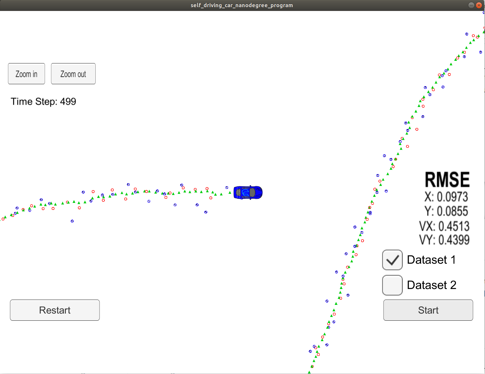
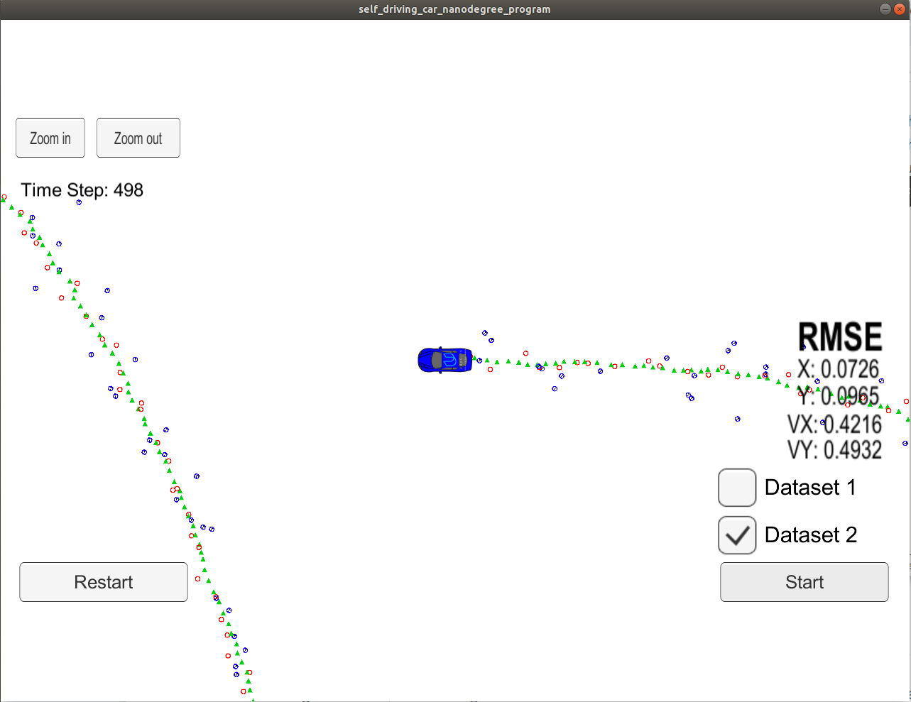

# Extended Kalman Filter Project Starter Code
Self-Driving Car Engineer Nanodegree Program

In this project you will utilize a kalman filter to estimate the state of a moving object of interest with noisy lidar and radar measurements. Passing the project requires obtaining RMSE values that are lower than the tolerance outlined in the project rubric. 

This project involves the Term 2 Simulator which can be downloaded [here](https://github.com/udacity/self-driving-car-sim/releases)

This repository includes two files that can be used to set up and install [uWebSocketIO](https://github.com/uWebSockets/uWebSockets) for either Linux or Mac systems. For windows you can use either Docker, VMware, or even [Windows 10 Bash on Ubuntu](https://www.howtogeek.com/249966/how-to-install-and-use-the-linux-bash-shell-on-windows-10/) to install uWebSocketIO. Please see the uWebSocketIO Starter Guide page in the classroom within the EKF Project lesson for the required version and installation scripts.

Once the install for uWebSocketIO is complete, the main program can be built and run by doing the following from the project top directory.

1. mkdir build
2. cd build
3. cmake ..
4. make
5. ./ExtendedKF

Tips for setting up your environment can be found in the classroom lesson for this project.

Note that the programs that need to be written to accomplish the project are src/FusionEKF.cpp, src/FusionEKF.h, kalman_filter.cpp, kalman_filter.h, tools.cpp, and tools.h

The program main.cpp has already been filled out, but feel free to modify it.

Here is the main protocol that main.cpp uses for uWebSocketIO in communicating with the simulator.

INPUT: values provided by the simulator to the c++ program

["sensor_measurement"] => the measurement that the simulator observed (either lidar or radar)

OUTPUT: values provided by the c++ program to the simulator

["estimate_x"] <= kalman filter estimated position x
["estimate_y"] <= kalman filter estimated position y
["rmse_x"]
["rmse_y"]
["rmse_vx"]
["rmse_vy"]

---

## Other Important Dependencies

* cmake >= 3.5
  * All OSes: [click here for installation instructions](https://cmake.org/install/)
* make >= 4.1 (Linux, Mac), 3.81 (Windows)
  * Linux: make is installed by default on most Linux distros
  * Mac: [install Xcode command line tools to get make](https://developer.apple.com/xcode/features/)
  * Windows: [Click here for installation instructions](http://gnuwin32.sourceforge.net/packages/make.htm)
* gcc/g++ >= 5.4
  * Linux: gcc / g++ is installed by default on most Linux distros
  * Mac: same deal as make - [install Xcode command line tools](https://developer.apple.com/xcode/features/)
  * Windows: recommend using [MinGW](http://www.mingw.org/)

## Basic Build Instructions

1. Clone this repo.
2. Make a build directory: `mkdir build && cd build`
3. Compile: `cmake .. && make` 
   * On windows, you may need to run: `cmake .. -G "Unix Makefiles" && make`
4. Run it: `./ExtendedKF `

I've built the project and uploaded the files in 'build' folder. If you want to build your own, please delete it and rerun the command above.

## Kalman Filter Improvement

The implementation of Kalman filter follows exactly what is taught in the lecture. However, two modifications are made to the extended Kalman filter for the Radar measurement. These two changes help to make the estimation of error, the y vector, more accurate and reduce the RMSE effectively.

1. We use atan2(y_pred, x_pred) to compute the estimated value of angle when a measurement from Radar is given. However, atan2 is not well defined when y_pred and x_pred are both zero. The value of the angle doesn't make a difference in the location of the moving object. Therefore, when |y_pred| < 1e-3 && |x_pred| < 1e-3, the error of angle (y[1]) is set to 0 regardless of the actual measurement.
2. The error of angle (y[1]) can be further improved. We explain this by giving the following example. Assuming the true location of the car is at (-1, 0.001) and the predicted value of the car is (-1, -0.001). Then the angle measured by Radar is roughly equal to PI while its predicted value equals atan2(-0.001,1) = -PI. Then y[1] = PI - (-PI) = 2PI. When this happens, the updated measurement will jump from a value that is close to the ground truth to some value that doesn't make sense at all. To avoid this, the error is added or deducted by 2PI so that it is kept between [-PI, PI].

## Result

My Kalman filter is tested on both data1 and data2. The requirement is that px, py, vx, and vy RMSE should be less than or equal to the values [.11, .11, 0.52, 0.52]. The implementation with the above two improvements meets the requirement for both data1 and data2, as is shown below:

